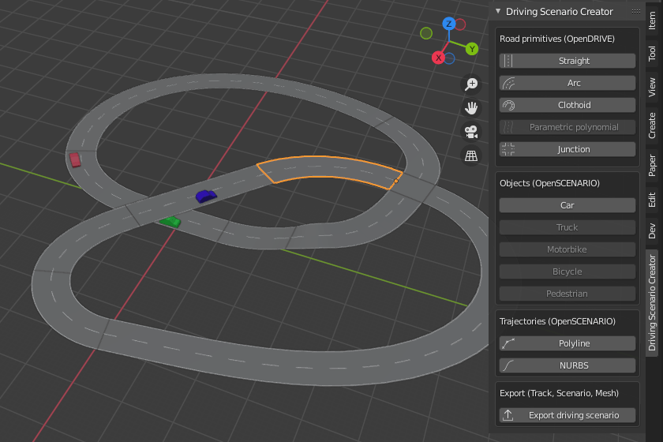

# Blender Driving Scenario Creator add-on

This [Blender](https://www.blender.org/) add-on lets you create OpenDRIVE and
OpenSCENARIO based scenarios for development and testing of advanced driver
assistance systems and autonomous driving functions.

## How to install

Prior to installing the add-on inside of Blender some requirements must be
installed. The process slightly differs for Linux and Windows.

###  Requirements Linux

For the sake of simplifying the following instructions let's assume that we
work with a Debian based Linux distribution (such as Ubuntu or Mint) and Blender
has been [downloaded](https://www.blender.org/download/) and installed to

    /opt/blender/

Then we first need to install the
[scenarigeneration](https://github.com/pyoscx/scenariogeneration) library into
the Blender Python environment since the add-on uses the library as a backend to
write OpenDRIVE and OpenSCENARIO files. Additionally,
[pyclothoids](https://github.com/phillipd94/pyclothoids) is needed which is used
by the addon and the scenarigeneration lib as well. Navigate to your Blender
included Python installation

    cd /opt/blender/<blender_version>/python/bin

if pip is not already present in there then run (use sudo only if root is the
owner)

    sudo ./python<python_version> -m ensurepip

now install the lib(s)

    sudo -E ./pip3 install scenariogeneration

where the `-E` makes sudo preserve the exported environment variable. Note again
that `sudo` is not required in case Blender is installed to the user home
directory. Also make sure not to mix up `pip3` and `./pip3`.

For the esmini export functionality we also need to install
[OpenSceneGraph](http://www.openscenegraph.org/) to have the `osgconv` tool
available. This is necessary because Blender is unable to directly export to the
.osgb scenegraph format, while esmini can only process this particular format.
On a Debian/Ubuntu/Mint system this can be achieved with

    sudo apt install openscenegraph

If you manually install OpenSceneGraph make sure that `osgconv` can be found
through your `PATH` environment variable, otherwise the export with .osgb 3D
model files will fail.

Install [esmini](ttps://github.com/esmini/esmini/releases). Preferably to
`/opt/esmini` and then put `/opt/esmini/bin` it in your `PATH` environment
variable with an `export PATH=$PATH:/opt/esmini/bin` at the end of the
`~/.bashrc`.

### Requirements Windows

Assuming Blender has been [downloaded](https://www.blender.org/download/) and
installed using the .msi installer, open PowerShell in admin mode by pressing
<kbd>Windows</kbd>+<kbd>X</kbd> and then then <kbd>A</kbd>.

In PowerShell navigate to the Blender install folder with (don't forget to
insert the version number)

    cd "C:\Program Files\Blender Foundation\Blender <blender_version>\<blender_version>\python\bin"

Run the following command to install the scenariogeneration library

    .\python -m pip install scenariogeneration --target ..\lib\site-packages

Note that you might be able to do this without admin rights in case you are
using the "Portable" version of Blender. Also if you are having trouble with
this part of the installation, consider starting over with a clean installation
of Blender and/or removing any leftovers of Python in your `%appdata%` folder.

Download and extract (for example to `C:\Tools\OpenSceneGraph`)
[openscenegraph](https://objexx.com/OpenSceneGraph.html).

Also download and extract (for exampe to `C:\Tools\esmini`)
[esmini](https://github.com/esmini/esmini/releases).

Add the OpenSceneGraph `bin` folder and the esmini `bin` folder to the `PATH`
environment variable using the "Edit environment variables for your account"
tool (look for it in the Windows start menu). Note that otherwise the export
with .osgb 3D model files will fail because `osgconv` can not be found by the
add-on.

### Add-on (Linux and Windows)

Finally download the driving scenario generator [release .zip
archive](https://github.com/johschmitz/blender-driving-scenario-creator/releases/).
Open Blender and go to Edit -> Preferences -> Add-ons. Click "Install...".
Select the .zip archive and confirm. Activate the add-on by ticking the little
box next to it, in the add-on list.

## How to use

When you are in the Blender "Layout" workspace press <kbd>N</kbd> or click the
little arrow next to the navigation gizmo to toggle the sidebar. Click
<kbd>Driving Scenario Creator</kbd> in the sidebar. From here you can create
roads and vehicles using the mouse by clicking the buttons in the "Driving
Scenario Creator" menu. Roads, vehicles and trajectories can be placed with the
mouse. Snapping can be activated by holding <kbd>Ctrl</kbd>. Start heading of a
road can be changed by holding <kbd>Shift</kbd>. Road elevation can be
controlled with <kbd>E</kbd>(perspective) or <kbd>S</kbd>(sideview) keys. Add
additional Blender objects as desired. When ready, export everything together by
clicking <kbd>Export driving scenario</kbd>. Choose a **directory** and a 3D
file format (.fbx, .gltf, .osgb) for the export and confirm.

## How to run exported scenarios

With esmini available the exported scenario can be run with

    cd <export_directory>
    esmini --osc xosc/bdsc_export.xosc --window 50 50 800 400

# How to develop

For development of the addon the [Blender VS Code
extension](https://github.com/JacquesLucke/blender_vscode) is very
recommendable. It allows hot reloading and rapid iterations.

## License

The source code of this tool is distributed under the GPL version 3.0 license as
required for all Blender add-ons. Note, that this does not imply that the tool
can not be used in a commercial context. In fact, there is probably no issue
using it in the same way as you would use Blender itself, Linux or GCC since you
will probably not be modifying the source code and/or linking against it.

Furthermore, if your enterprise has already reached a state where open source
software contribution is possible or your business has embraced open source
software long ago, your contributions and pull requests are welcome if they are
maintainable.

## Credits

Credits for the current version go to
- [pyoscx/scenarigeneration](https://github.com/pyoscx/scenariogeneration)
  developers for the .xodr/.xosc generating/writing lib used as backend
- [Archipack](https://github.com/s-leger/archipack) add-on developer(s) for
  general Blender add-on tool inspiration
- [Blender VS Code extension](https://github.com/JacquesLucke/blender_vscode)
  for quick iterative development and hot reloading
- [pyclothoids](https://github.com/phillipd94/pyclothoids) which is a Python
  wrapper for Enrico Bertolazzi's
  [Clothoids](https://github.com/ebertolazzi/Clothoids) library

## Main author/maintainer contact

Please open issues and pull requests on GitHub to discuss openly. For private
support inquiries contact the repository owner via email, Twitter or create an
issue to initiate the communication. If you consider contributing large new
features please consider to have a discussion before beginning with the clean
implementation.
